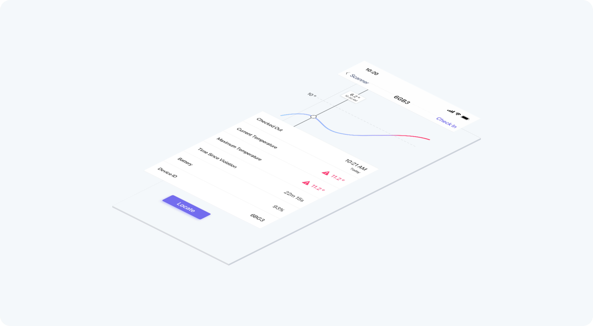
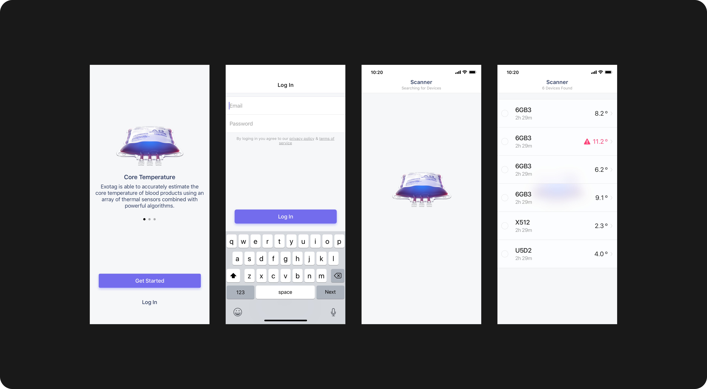
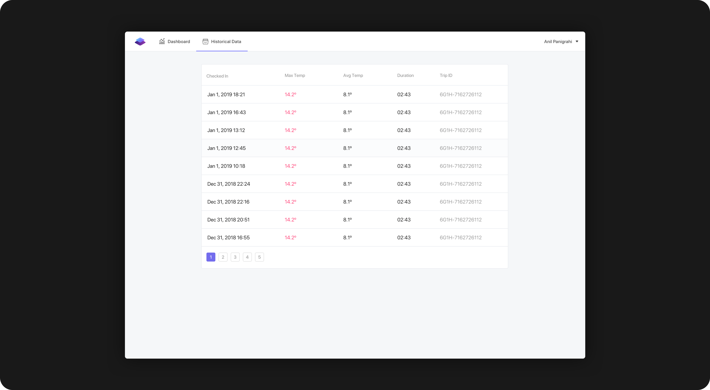
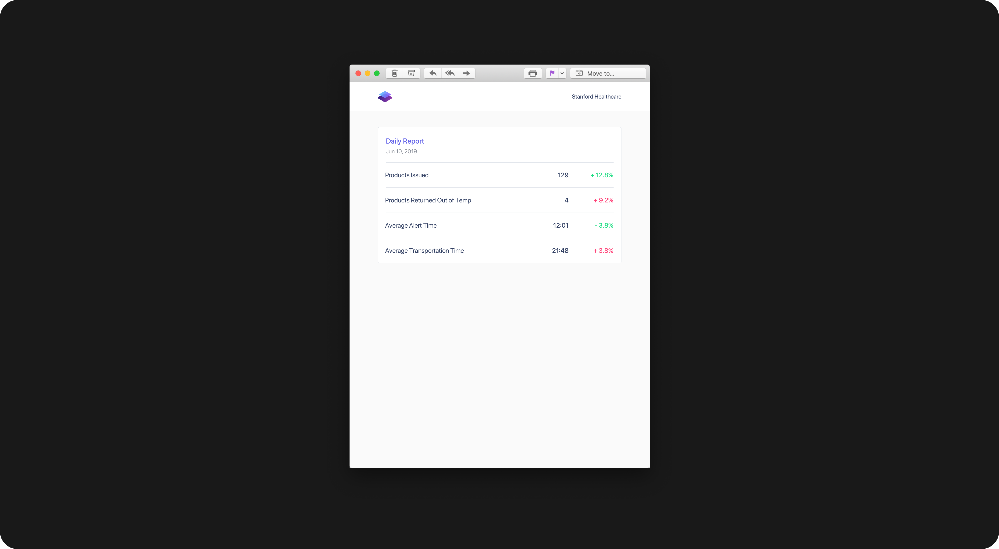

{: .post-image .img-120} 

Detail view that shows the temperature history of the blood product.
{: .post-caption}

During transportation, blood products must be maintained between 1-10 ºC or else they must be thrown away. Based on thermodynamic models, our device is able to anticipate when a blood product will go out of that range and alert hospital staff.
{: .post-paragraph-embedded}

When the blood product is returned to the blood bank, the staff uses our mobile app to connect to the device and view it's temperature profile. It was important that the process be quick and easy in order to avoid disrupting current workflows.
{: .post-paragraph-embedded-last}

{: .post-image .img-120}

A selection of screens from the mobile app.
{: .post-caption}

Our minimum viable product is only able to view real-time data and we plan to add historical data inside the web application.
{: .post-paragraph-embedded-last}

{: .post-image .img-120}

Blood product history view on web application.
{: .post-caption}

All screens in the system were created from 4 base layouts that were designed to maintain visual consistency and make internationalization easy.
{: .post-paragraph-embedded-last}

{: .post-image .img-120}

An email report that displays weekly analytics.
{: .post-caption}

Visual styles are consistent across mobile, web and email.
{: .post-paragraph-embedded-last}