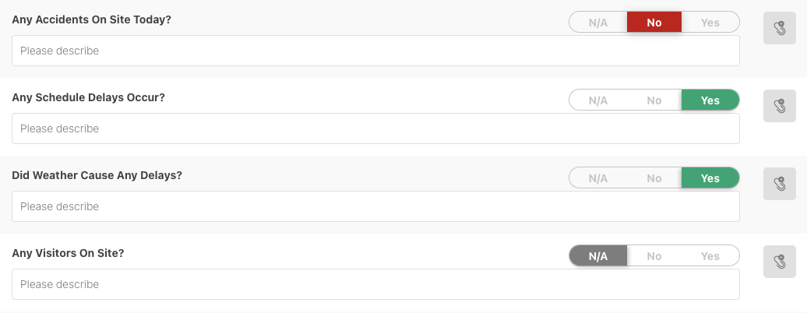
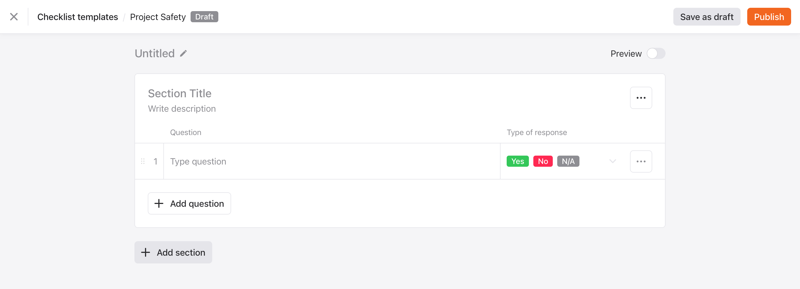
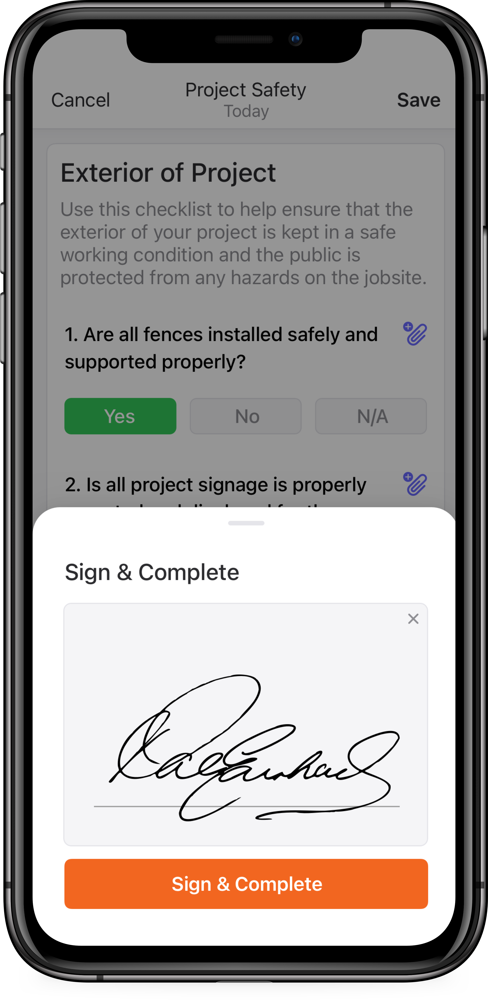

[Raken](https://rakenapp.com) is a tool for field-office collaboration in the construction industry. Raken has four established product offerings: Daily Reporting, Production Tracking, Time Cards, and Safety Management.

Beginning in February 2020 I worked with a small team --- one researcher, one product manager, and another product designer --- to produce a new feature that eventually came to be known as [Checklists](https://www.rakenapp.com/daily-reports).

<mark>Our objective was to build a customizable form feature that would suite the needs of enterprise safety managers in order to promote Raken as a robust safety solution.</mark>

## Competitive Analysis

As with any design process, we began by conducting research — qualitative surveys of our users, lab studies in our Carlsbad office, and competitor analysis.

> “Everything is happening with pen and paper except for the site safety inspections which we are using iAuditor for. For pen and paper checklists, users are taking a picture of it and attaching it to their Dailies.”
> Rylan Page, Vector Group

One of the sub-features of [Daily Reports](https://www.rakenapp.com/daily-reports) is called Surveys. Built as a simple way for workers to answer a set of yes-no questions; it was quickly adopted by our small business market but our mid-market and enterprise clients had more specialized needs.

{: .post-image .img-120 .mt}

Original design of the survey feature.
{: .post-caption}

The existing design had several limitations:

- Only one set of questions per day
- Yes-no responses were not appropriate for all questions
- Yes and No were depicted as positive and negative respectively even though a Yes response could be a negative outcome
{:.mb}

Since construction activities vary greatly from day to day, we saw an opportunity to expand functionality and capture more workflows.

## Building a template

We conducted dozens of user interviews, spoke with our sales and customer support teams, and consulted our in-house industry experts. The results were clear. <mark>We needed to overhaul our existing "survey" experience</mark> to allow an admin to create an entire library of checklist templates, each with their own set of questions and response types. Check out the prototype for the [Web](https://www.sketch.com/s/ae80686d-bb0f-4a5f-b2b2-40eaf43c2fc2/a/5a47rp/play) experience.

{: .post-image .img-120 .mt}

## Completing a checklist

<mark>The completion workflow had to be straightforward.</mark> Every question and response needed to follow the same format and would also allow users to attach additional content such as notes, photos, or documents.  Check out the prototypes for the [Web](https://www.sketch.com/s/ae80686d-bb0f-4a5f-b2b2-40eaf43c2fc2/a/lq8AMV/play) and [iOS](https://www.sketch.com/s/39012f72-9c4a-4218-a190-46330a5f510a/a/Aw99Or/play) experiences. 

{: .img-50 .mt .mb}

## Results

In October 2020 we began rolling out the feature to great success. Not only did we see customers use checklists frequently—and qualitative research indicated it was a much better experience—but we also had the chance to ship the first modern web interface using Raken's new product language. Helping shape the way for future Raken web tools.