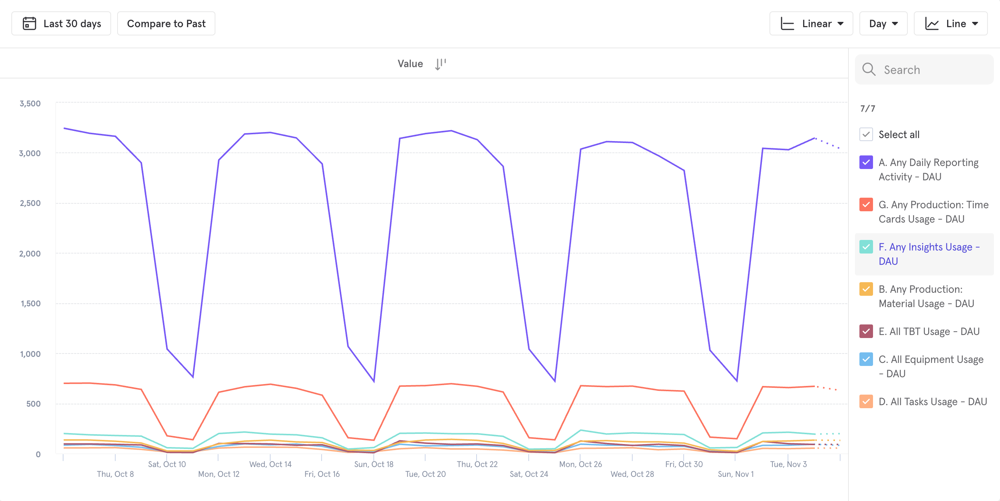

<mark>When I first joined Raken, features in our web application were painfully fragmented.</mark>
{: .post-paragraph-embedded}

Through customer feedback and event tracking, the team had come to learn that existing features beyond our daily reporting tools were not being adopted by our users.
{: .post-paragraph-embedded}

Engineering teams were spending months on new features only to find that adoption was incredibly low even though these were highly asked-for features.
{: .post-paragraph-embedded}

This was partially symptomatic of where Raken found product market fit initially: people knew us as a daily reporting solution and nothing more.
{: .post-paragraph-embedded-last}

{: .post-image}
Mixpanel data showing feature usage.
{: .post-caption}

From production tracking, timecards, and safety talks, to checklists. Users had to navigate away from the daily report in order to discover them.
{: .post-paragraph-embedded}

My role was to work with stakeholders across the organization in order to understand how changes to the navigation might affect operations and to envision how we might improve the experience.
{: .post-paragraph-embedded}

We knew from research that user’s who were taught about our extended features were much more likely to continue using them after their training period ended. We also knew that the needs of companies using these features was highly variable; there was no single flow that could work for everyone.
{: .post-paragraph-embedded}

All of this highlighted the fundamental problem with how Raken’s information architecture was set up: having a highly nested navigation hierarchy meant that user’s rarely ventured out of the features that they were familiar with.
{: .post-paragraph-embedded-last}

<video autoplay loop>
  <source src="../images/project-and-company.mp4" type="video/mp4">
  <source src="../images/project-and-company.webm" type="video/webm">
  
Your browser doesn't support HTML5 video. Here is
     a <a href="../images/project-and-company.mp4">link to the video</a> instead.

</video>
{: .post-image}

This is something
{: .post-caption}

Using atomic design principles ensures that every component in the library has all the necessary overrides as self contained symbols. 
{: .post-paragraph-embedded-last}

{: .post-image}
The design system will support the new iOS 13 dark mode.
{: .post-caption}

One of the biggest challenges was optimizing the library to make it easy for designers to switch between different states of a component quickly. The taxonomy of the naming conventions was designed to make the last property the most useful depending on the component.
{: .post-paragraph-embedded-last}