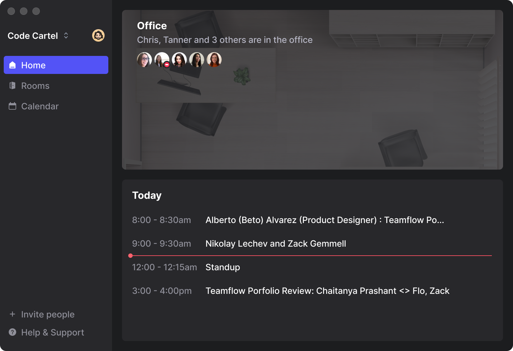

<!-- Teamflow was founded during the COVID-19 pandemic as a tool to help teams who had previously been in the office deal with the new reality of remote work. Teamflow offered a virtual space where people could co-work and hangout through out the day and bring back some of the collaboration and spontaneus connections that being in an office allowed for. 

The virtual office product was great but people were dropping off when they would join meetings. There is a network effect to the virtual office where simultaneously you need to be online and have your coworkers online in order to get value from the product. We decided to explore the idea of what a meetings product might look like as part of the core office product. -->

Founded during the COVID-19 pandemic, Teamflow was created to help teams transition to remote work by offering a virtual space for daily collaboration and spontaneous interactions.


<!-- Overview
 - Problem
 - Solution 1 - Virtual office + Meetings
 - Make a better meeting experience
 - Virtual canvas for apps/screensharing
 - Presenter mode
 - All features designed for spatial/meetings
 - Meeting recording
 
 -->

{:.post-image .mt .mb .zoom-image }

While the virtual office concept worked well, user engagement declined as people would drop off for meetings. To address this, we explored adding a dedicated meetings feature to our core product.

{: .post-image .img-120 .mt .mb .zoom-image }

{: .post-image .img-120 .mt .mb .zoom-image }

In order to compete on old ground we decided that we needed to do everything better.

```javascript
var s = "JavaScript syntax highlighting";
alert(s);
```

## Multi-screensharing

## Presenter Mode

## Breakout rooms

<video autoplay loop width="100%">
  <source src="../assets/img/teamflow/breakout-rooms.mp4" type="video/mp4">
  <source src="../assets/img/teamflow/breakout-rooms.webm" type="video/webm">
  <p>Your browser doesn't support HTML5 video. Here is
     a <a href="../assets/img/teamflow/breakout-rooms.mp4">link to the video</a> instead.</p>
</video>{:.img-post .mb .mt}