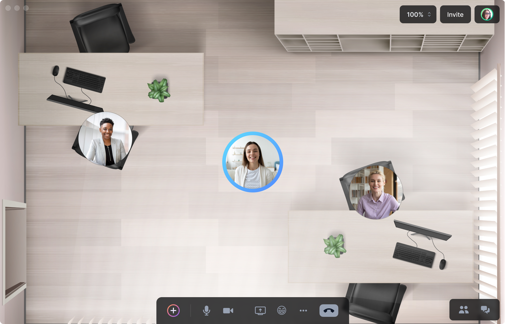
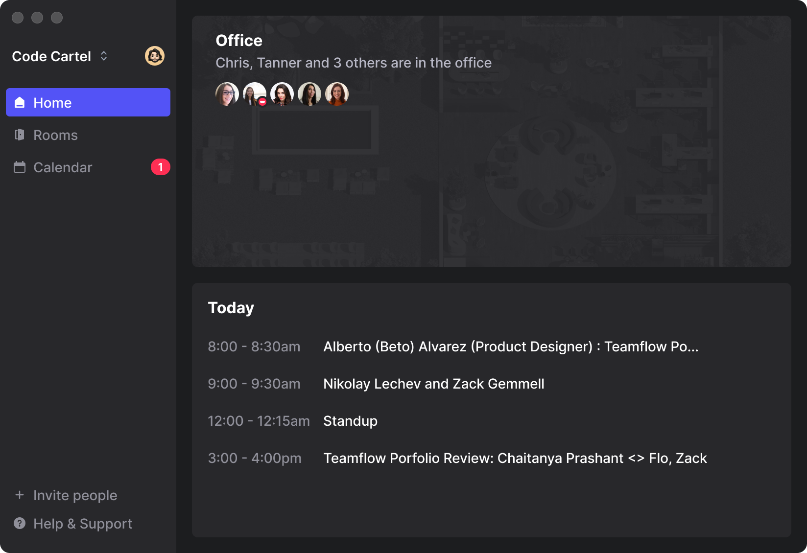
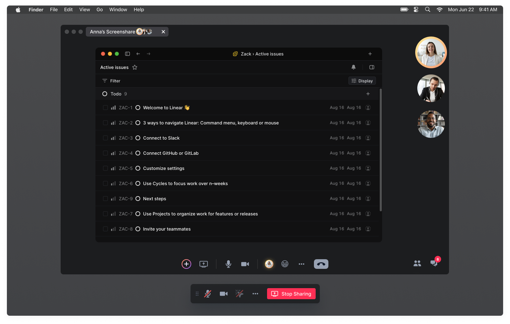

<!-- Overview
 - Virtual canvas for apps/screensharing
 - Presenter mode
 - All features designed for spatial/meetings
 - Meeting recording
 -->

<!-- Problem -->

Founded during the COVID-19 pandemic, Teamflow was created to help teams transition to remote work by offering a virtual space for daily collaboration and spontaneous interactions. The virtual office experience gave co-workers the ability to socialize and collaborate at will. 

{: .post-image .img-120 .mt .zoom-image }

The virtual office experience
{: .post-caption}

While the virtual office worked well, user engagement declined throughout the day as people dropped off for meetings and did not return. To address this, I explored adding a dedicated meetings product along side the virtual office experience. In order to combine these two experiences I designed a new entry point into the app called the hub.
{: .post-paragraph-embedded-last}

<!-- Make a better meeting experience -->
{:.post-image .mt .zoom-image }

The hub allowed people to join their meetings or enter the virtual office from one place.
{: .post-caption}

The new meeting feature needed to have feature parity with competing products like Zoom and Google Meets while providing a similar experience to our own virtual office.
{: .post-paragraph-embedded-last}

<!-- {: .post-image .img-120 .mt .mb .zoom-image } -->

## Presenter Mode

I re-imagined familiar features such as screensharing and added a concept for presenter mode which let people take control of a meeting when it was their turn to share.

<video autoplay loop width="100%">
  <source src="../assets/img/teamflow/presenter-mode.mp4" type="video/mp4">
  <source src="../assets/img/teamflow/presenter-mode.webm" type="video/webm">
  
Your browser doesn't support HTML5 video. Here is
     a <a href="../assets/img/teamflow/presenter-mode.mp4">link to the video</a> instead.

</video>{:.img-post .mb .mt}

## Breakout rooms

I wanted a continuity between the virtual office and meetings in the ways that the user could interact. Breakout rooms can be generated by dragging your avatar away from the group just like you would move away from the group in the virtual office.

<video autoplay loop width="100%">
  <source src="../assets/img/teamflow/breakout-rooms.mp4" type="video/mp4">
  <source src="../assets/img/teamflow/breakout-rooms.webm" type="video/webm">
  
Your browser doesn't support HTML5 video. Here is
     a <a href="../assets/img/teamflow/breakout-rooms.mp4">link to the video</a> instead.

</video>{:.img-post .mb .mt}

<!-- {:.post-image .mt .zoom-image } -->